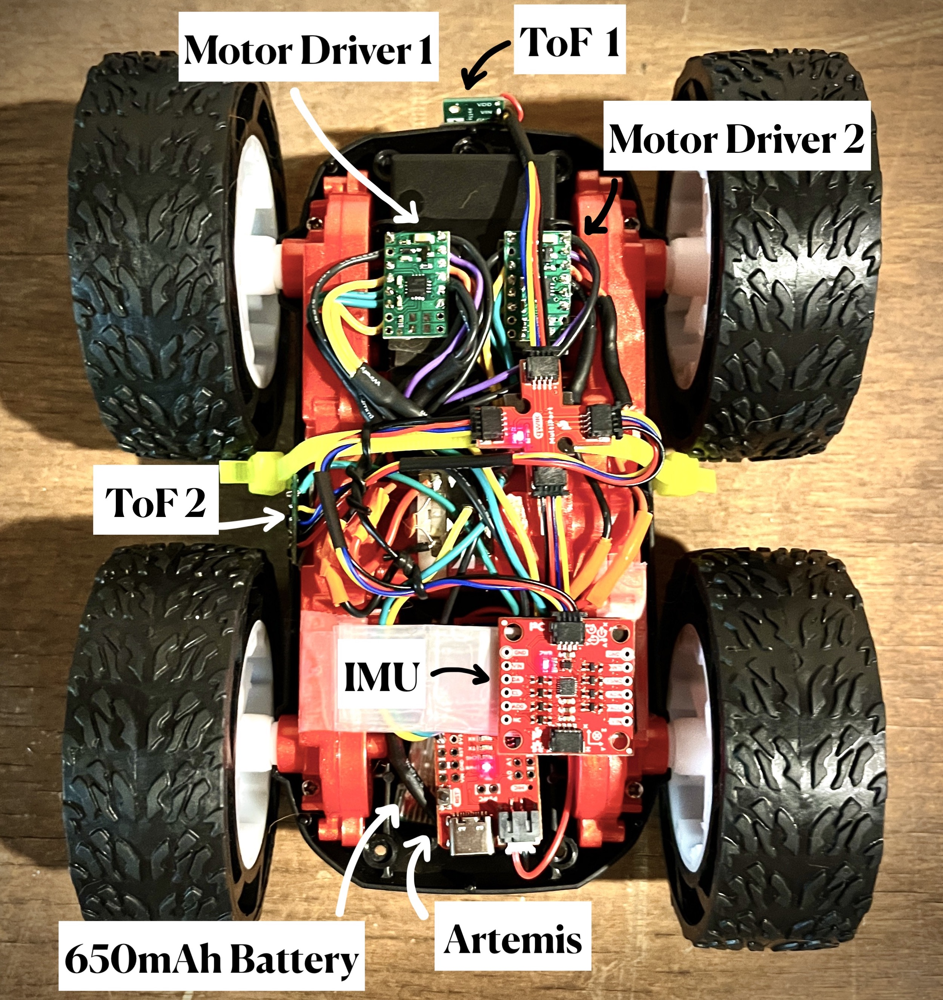
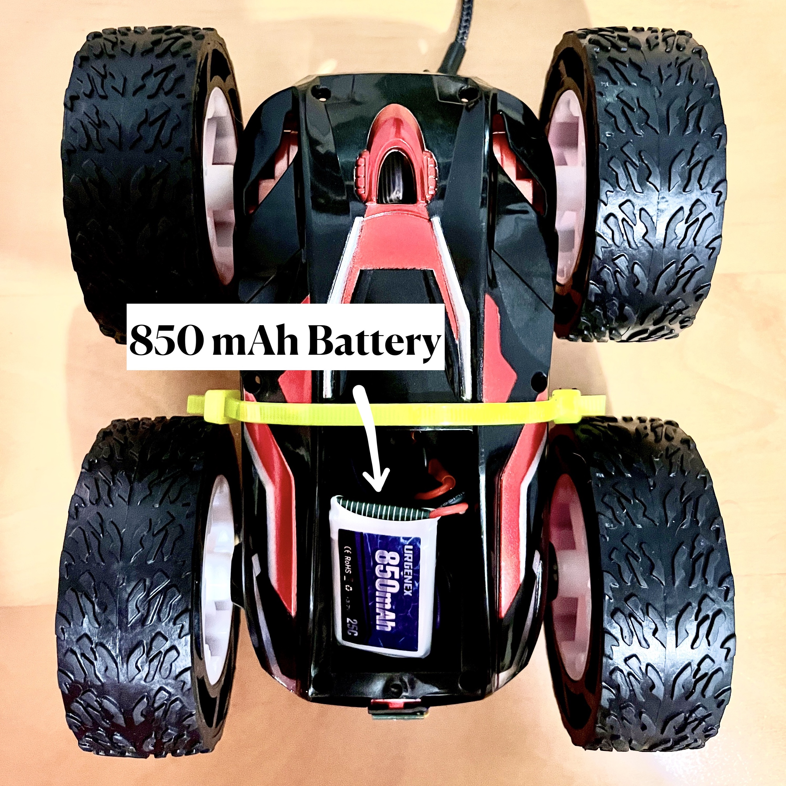

# Sockie3.github.io
This GitHub page is dedicated to documenting the Fast Robots project. The purpose of this project was to design and build a robotic miniature RC car and apply a variety of robotics principles to it. Some of these principles include Proportional-Integral-Derivative feedback control, Mapping, Kalman Filter, and Path Planning. This project is split up into 12 labs in which I descibe the lab procedure and analyze data.

Link to my webpage:
[https://sockie3.github.io/#about](https://sockie3.github.io/sokolova-fast-robots-2023/)

